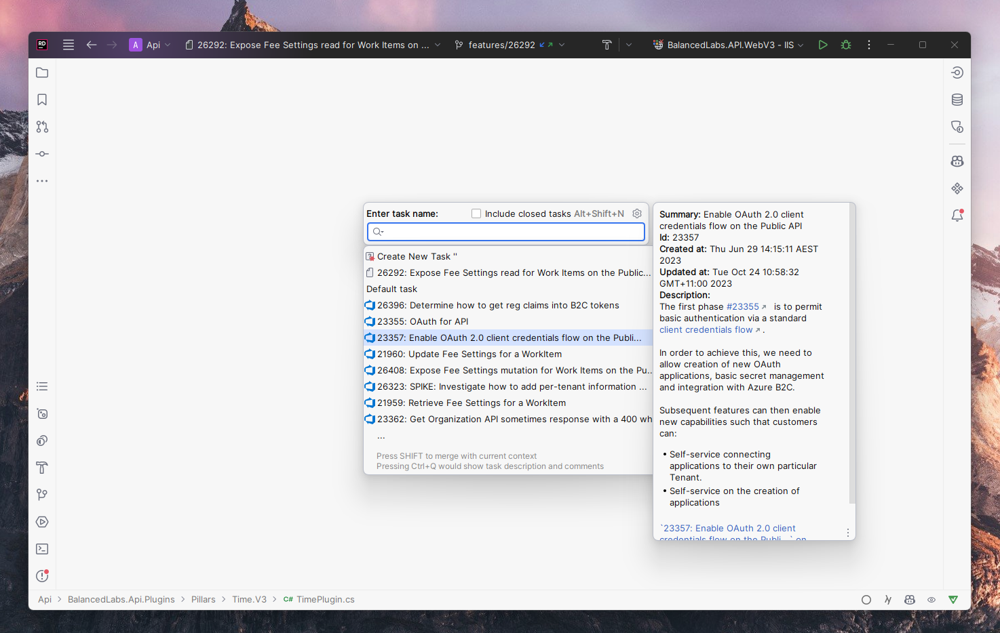

# JetBrains Azure DevOps plugin

This plugin enables [JetBrains](https://www.jetbrains.com/) IDEs (like Rider, DataGrip, etc) to access [Azure DevOps](https://azure.microsoft.com/en-au/products/devops)
for [Task Management](https://www.jetbrains.com/help/idea/managing-tasks-and-context.html).

## Installation

* Download the latest build from [GitHub actions](https://github.com/mattkleiny/jetbrains-azure-devops-plugin/actions)
* Install the [plugin from disk in your IDE](https://www.jetbrains.com/help/idea/managing-plugins.html#install_plugin_from_disk). All JetBrains IDEs should be supported.
* Add a new server and select `AzureDevOps` as the server type. You can find the settings under `Tools -> Tasks -> Servers`.
  * Enter your desired Team ID.
  * Enter your desired Project Name.
  * Enter your own [Personal Access Token](https://learn.microsoft.com/en-us/azure/devops/organizations/accounts/use-personal-access-tokens-to-authenticate?view=azure-devops&tabs=Windows) for Azure DevOps.
    * It needs the following permissions:
      * Project and Team: `Read`
      * Work Items: `Read & Write`

You can now open the `Tasks` tool window, and it should now display work items from the Azure DevOps instance.

## Features

At the moment, the tool will only show Work Items that assigned to the Access Token owner.

Most of the standard Task Management features are supported:
- [x] Open extended issue details
- [x] Search open issues
- [x] Search closed issues
- [x] Changelists and commit messages

These features aren't supported:
- [ ] Comments
- [ ] Time tracking

## Changelog
### 2025-04-08 
- Updated the GitHub pipeline to use the latest version of the upstream GitHub action, fixes failure to run due to dependency on retired version
